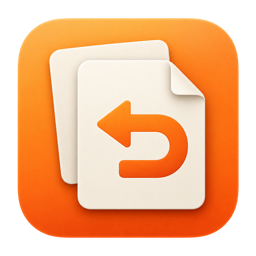

<p align="center">
  
</p>
<h1 align="center">拾贴 · Clipmori</h1>
<p align="center"><strong>随手复制，随时找回。</strong><br>原生 macOS 剪贴板历史工具，让复制过的内容随时可用。</p>
<p align="center">
  <a href="https://github.com/princeniu/LocalPaste/actions/workflows/ci.yml"></a>
  
  
  <a href="LICENSE"></a>
</p>
<p align="center"><a href="README.md">简体中文</a> · <a href="README.en.md">English</a></p>

[功能](#功能) · [安装](#安装) · [使用](#使用) · [隐私](#隐私) · [常见问题](#常见问题) · [参与贡献](#参与贡献)

拾贴是一个原生 macOS 剪贴板历史工具。复制过的文字、图片和文件，以横向卡片保存在屏幕底部；搜索、滚动、预览，再把需要的内容贴回正在使用的应用。

无需账号，历史保存在本机。当前为 **1.2.0 早期版本**，界面以简体中文为主；源码已开放，暂未提供经过公证的安装包、Homebrew 分发或自动更新。

## 功能

| 日常操作 | 拾贴如何帮助你 |
| --- | --- |
| 找回复制内容 | 支持文字、链接、图片、富文本和 Finder 多文件引用 |
| 快速浏览 | 横向历史卡片；上下鼠标滚轮也能左右浏览 |
| 精确查找 | 搜索内容或来源应用，空格预览完整内容 |
| 再次粘贴 | 原格式或纯文本粘贴；支持键盘和鼠标操作 |
| 整理常用内容 | 收藏、分类；普通历史限制条数，收藏长期保留 |
| 控制记录范围 | 暂停记录、排除应用、跳过标记为机密或临时的内容 |
| 备份与恢复 | 导出历史、收藏和分类，预览后合并导入，保留本机已有记录 |
| 融入 macOS | 菜单栏常驻、自定义快捷键、登录启动、系统外观 |

## 安装

目前请从源码构建。需要 **macOS 14+、完整 Xcode 与 XcodeGen**；本地已使用 Xcode 26 构建，CI 在 macOS 15 上执行回归与 Release 构建。

已安装 Homebrew 的开发者可以这样开始：

```sh
brew install xcodegen
git clone https://github.com/princeniu/LocalPaste.git
cd LocalPaste
scripts/build-release.sh
```

脚本会输出 `Clipmori.app` 的位置，同目录包含 ZIP 和构建摘要。默认产物未签名；日用构建建议使用自己的稳定签名身份：

```sh
LOCALPASTE_SIGNING_IDENTITY="你的有效签名身份" scripts/build-release.sh
```

将构建的 App 放入“应用程序”后打开。它是菜单栏应用，不显示 Dock 图标。自动粘贴需在“系统设置 → 隐私与安全性 → 辅助功能”中授权；未授权时可恢复内容后手动按 `⌘V`。

签名不等于公证。完整步骤和已有 LocalPaste 用户的升级说明见[首次运行指南](docs/runbooks/first-run.md)。项目仍沿用 LocalPaste 的仓库名和 Bundle ID，以兼容原有数据。

## 使用

1. 像平时一样复制内容。
2. 按 `⌘⇧V`，或从菜单栏打开历史。
3. 搜索或滚动找到卡片，点击即可尝试粘贴回原应用。

| 操作 | 快捷方式 |
| --- | --- |
| 打开历史 | `⌘⇧V`，可在设置中修改 |
| 选择卡片 | `←` / `→` |
| 横向浏览 | 上下鼠标滚轮或横向触控板手势 |
| 粘贴选中内容 | `Return` 或点击卡片 |
| 预览 | `Space` |
| 关闭面板 | `Esc` |
| 更多操作 | 右键卡片 |

方向键和空格在卡片浏览时生效；编辑搜索框时保留正常文字操作。使用指南也可在“设置 → 关于”重新打开。

### 备份与恢复

进入“设置 → 数据”导出 `.clipmori` 文件，或选择“从备份导入”。导入前显示新增历史、收藏和分类数量；同名分类合并，重复记录保留本机版本。若需要提高历史保留条数，预览会明确提示。

备份不包含偏好、系统权限或文件本体。单份最大 **256 MB**，合并后的普通历史最多 **5,000 条**。

## 隐私

- 应用不提供账号、云同步、遥测或联网功能。
- 历史数据库和备份文件**未加密**，请妥善保管；复制敏感内容前建议暂停记录。
- 应用排除和机密类型过滤是尽力保护，macOS 的来源识别限制使其无法保证过滤所有敏感内容。
- 文件记录只保存引用；原文件移动或删除后，记录可能无法再次使用。
- 历史默认存于 `~/Library/Application Support/com.prince.LocalPaste/`。

## 常见问题

**点击卡片为什么没有自动粘贴？** 先确认当前安装的拾贴已获得辅助功能授权。未授权时，内容仍会恢复到剪贴板，可切回目标应用手动按 `⌘V`。

**暂停后会补录暂停期间的内容吗？** 不会。恢复记录会从新的复制操作开始。

**备份可以把文件带到另一台 Mac 吗？** 不可以。文件类记录保存的是原路径引用，需要自行迁移原文件。

**是否已经适合正式分发？** 目前处于早期日用阶段。已完成隔离回归与部分实机验证，尚未完成公证安装包、自动更新及全部硬件场景验收。具体边界见[验证状态](docs/verification/STATUS.md)。

安装包构建与公证流程见[分发指南](docs/runbooks/distribution.md)。

## 参与贡献

欢迎提交 [Issue](https://github.com/princeniu/LocalPaste/issues) 或 Pull Request。错误报告请附 macOS 版本、拾贴版本、复现步骤及预期行为；不要上传真实剪贴板内容、备份、数据库或密钥。

开发入口与验证方法见[贡献指南](CONTRIBUTING.md)。当前优先处理日用体验和可靠性，再完善安装与更新流程；详见[路线图](docs/plans/next-phase.md)。

## 许可证

[MIT License](LICENSE) · Copyright © 2026 princeniu
